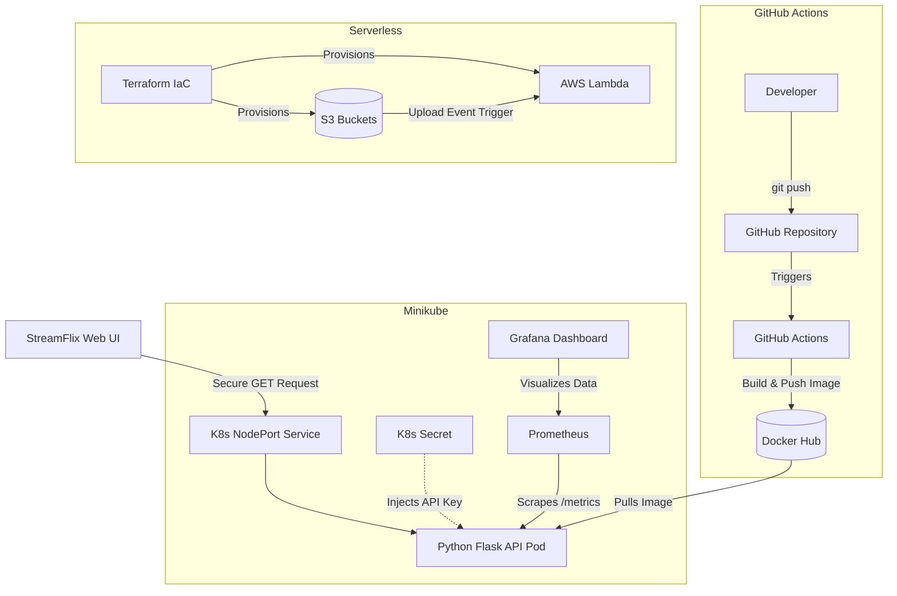

# 🚀 Hybrid-Cloud Video Processing Pipeline & StreamFlix UI

## 📖 Overview

This project is a **production-grade, event-driven video processing pipeline** that bridges modern cloud-native automation with scalable infrastructure.

It combines:

* ☁️ **AWS Serverless backend** for heavy video processing
* ⚙️ **Kubernetes cluster (Zero-Trust)** for metadata APIs
* 🎬 **StreamFlix UI frontend** to visualize and interact with the system

---

## 🏗️ Architecture Diagram

*(This diagram illustrates the automated CI/CD flow, hybrid-cloud deployment strategy, and frontend interaction.)*



---

## 🛠️ Tech Stack

### ☁️ Cloud Infrastructure

* AWS (S3, Lambda, IAM)

### ⚙️ Container Orchestration

* Kubernetes (Minikube, Deployments, Services, Secrets)

### 🔁 Automation & CI/CD

* Terraform (Infrastructure as Code)
* GitHub Actions
* Docker Hub

### 🧠 Backend

* Python (Flask)
* Docker

### 🎨 Frontend

* HTML5
* CSS3
* Vanilla JavaScript

### 📊 Observability

* Prometheus
* Grafana
* PromQL

---

## ✨ Key Engineering Features

### 🔐 Zero-Trust Security

* API endpoints secured via **Kubernetes Secrets**
* Secrets injected into containers at runtime
* No credentials stored in codebase

### 🔄 Zero-Downtime Deployments

* Kubernetes **rolling updates**
* Automatic rollback behavior if image fails (`ImagePullBackOff` safety)

### 🚀 Fully Automated CI/CD

* Push to `main` branch triggers:

  * Docker image build
  * Secure push to Docker Hub
  * Automatic deployment

### ♻️ Self-Healing Infrastructure

* Kubernetes **Deployment Controller** ensures:

  * Crashed pods are recreated instantly
  * Manual deletions are automatically recovered

### 📈 Full-Stack Observability

* Flask API exposes metrics via:

  * `prometheus-flask-exporter`
* Metrics visualized in Grafana dashboards

### 🌐 Decoupled Frontend

* Independent frontend communicates via:

  * Secure headers (`x-api-key`)
  * Strict CORS policies

---

## 🚀 How to Run Locally

### 📌 Prerequisites

Make sure you have:

* `minikube` and `kubectl`
* Docker Desktop (running)
* Docker Hub account

Optional:

* AWS CLI
* Terraform

---

### 1️⃣ Start Kubernetes Cluster

```bash
minikube start
eval $(minikube docker-env)
```

---

### 2️⃣ Create Kubernetes Secret

```bash
kubectl create secret generic video-api-secrets \
  --from-literal=API_KEY=my-super-secure-key-2026
```

---

### 3️⃣ Deploy Infrastructure

```bash
kubectl apply -f deployment.yaml
kubectl apply -f monitor.yaml
```

---

### 4️⃣ Run StreamFlix Frontend

```bash
cd video-platform-frontend
python3 -m http.server 8000
```

Open your browser:

```
http://localhost:8000
```

---

### 5️⃣ Test the Connection

#### ✅ From UI

Click:

> **"Fetch Secure Data from Kubernetes"**

---

#### 🔧 Using cURL

```bash
curl -s \
  -H "x-api-key: my-super-secure-key-2026" \
  http://$(minikube ip):30000/secure-data
```

---

## 📈 Monitoring & Observability

### Access Grafana Dashboard

```bash
kubectl port-forward svc/kube-prometheus-grafana \
  8080:80 -n monitoring --address 0.0.0.0
```

Open:

```
http://localhost:8080
```

---

### 📊 Example PromQL Query

```promql
flask_http_request_total
```

Use this to monitor:

* Request rates
* Traffic spikes
* Error trends

---

## 📌 Future Improvements

* 🔄 Add horizontal pod autoscaling (HPA)
* 🌍 Deploy to managed Kubernetes (EKS/GKE)
* 🔐 Implement OAuth2 / JWT authentication
* 🎥 Extend pipeline for real-time streaming
* 📦 Add Redis caching layer

---

## 🤝 Contributing

Contributions are welcome!

1. Fork the repository
2. Create a feature branch
3. Submit a pull request

---

## 📄 License

This project is licensed under the MIT License.
